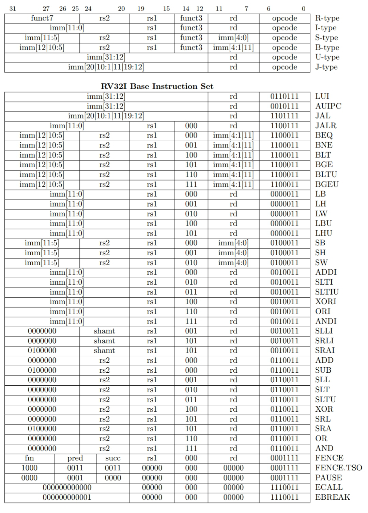
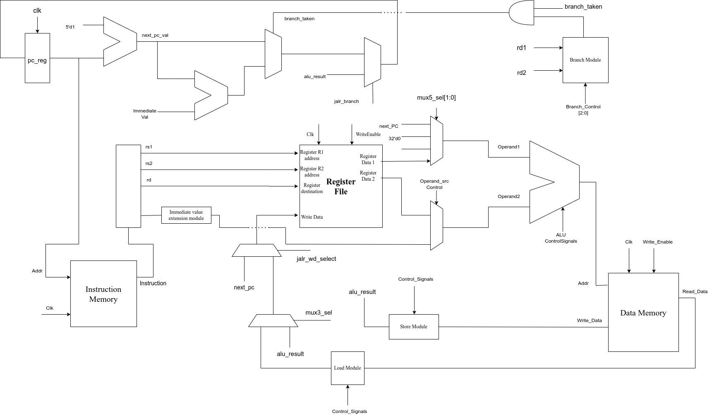
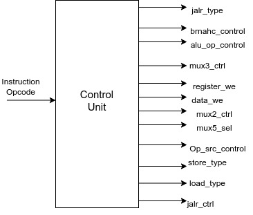
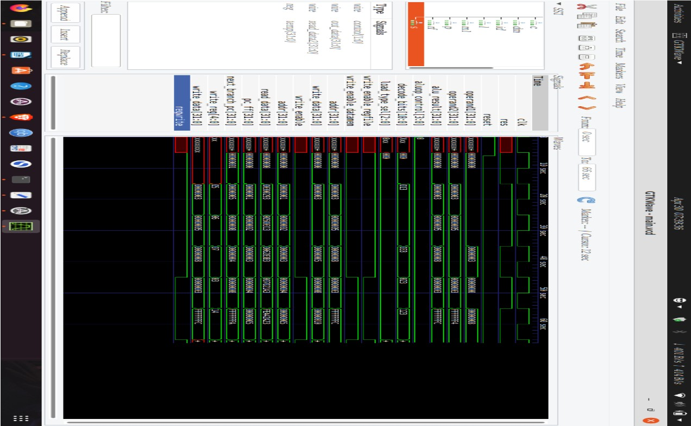

# RISCV

This Repository contains the source files and test files for the design of RISC-V RV32I Core and It's Implementation using Verilog.

## Contents 
 ---
- [RISCV ISA](#riscv-isa)
- [RV32I base core](#rv32i-base-core)
- [Micro-architecture Implementation](#micro-architecture-implementation)
- [RTL Coding for each Block in the Mirco-architecture](#rtl-code)
- [Writing Test Bench](#test-bench) 
- [Results](#results)

---
### RISCV ISA
RISC-V is an open-source instruction set architecture(ISA) based on the reduced instruction set computer (RISC) principles. It ws developed at the University of California, Berkeley in 2010.

An Instruction set architecture defiines the set of instructions that a processor can execute and the underlying structure of those instructions. The RISC-V ISA is designed to be simple, modular, and extensible, providing a solid foundation for a wide range of computing devices, from embedded systems to high-performace servers.

---
### RV32I Base Core
The RV32I base core refers to the base integer instruction set of the RISC-V ISA with a 32-bit word size. It is the fundamental and minimal instruction set for RISC-V processors that implement 32-bit architecture.

Here "RV32" part indicates that the base core operated on 32-bit data. Each instruction in the RV32I instruction set is 32 bits long. The "I" stands for "integer", indicating that base core provides a set of instructions for basic integer operations.

The RV32I Instruction set includes instructions for common operations such as arithemetic(addition, subtraction, multiplication), logical operations(bitwise AND, OR, XOR), shifting, loading/storing data from/to memory, branching and comparisons. It also includes instructions for manipulating control flow, such as unconditional jumps and conditional branches.The RV32I base core is the foundation upon which other standard extensions, such as multiplication and floating-point arithmetic, can be added. These extensions provide additional functionality beyond the base integer instructions.

The RV32I base core is often used in embedded systems, low-power devices, and applications where a 32-bit word size is sufficient. It provides a minimal yet powerful instruction set that forms the basis for RISC-V processor.

RV32I Core consists of a total of 47 instructions. Out of those 47 i've implemented 42 instructions excluding  FENCE, FENCE.TSO, PAUSE, ECALL, EBREAK. 
I am attaching the link for the image of those instruction set and instruction types. 

---
### Micro-architecture Implementation
__What is Micro-architecture ?__  
Micro-architecture, also known as computer organization, refers to the internal design and implementation of a processor or a digital logic system. It focuses on the low-level details of how a processor executes instructions and performs computations 
        Micro-architecture involves the design of various components within a processor, including the instruction pipeline, arithmetic and logic units (ALUs), control units, cache hierarchy, memory subsystem, and other functional units. It defines how these components are interconnected and how they work together to execute instructions and process data efficiently.

__RV32I Core Micro-Archiecture__  
The Below Diagram is the Micro-Architecture of the RV32I core.
 

It contains the following blocks
- ALU Unit
- Register File Unit
- Instruction Memory Unit
- Data Memory Unit
- PC Logic Unit
Control Unit for the above micro architecure is given below

### RTL Codes
***
We've developed RTL codes for our design. we have the following verilog files
- alu_module.v
        - _This module contains RTL code for the Arithemetic logic unit._
- branch_mod.v
        - _This module contains RTL code for the branch logic._
- control_logic.v
        - _This module contains RTL code for the control logic unit._
- data_mem.v
        - _This module contains RTL code for the data memory unit._
- instruction_mem.v
        - _This module contains RTL code for the Instruction memory unit._
- instr_decode.v
        - _This module contains RTL code for the Instruction decoding logic._
- load_mod.v
        - _This module contains RTL Code for the selection of load instructions._
- store_mod.v
        - _This module contains RTL Code for the selection of store instructions._
- register_file.v
        - _This module contains RTL code for the register file unit._
- pc_logic.v
        - _This module contains RTL code for the program counter logic._
- main.v
        - _This file integrates also the individual verilog files and make it one._
The Above files are the source files, it contains RTL Code of whole design.

### Test Bench
***
After RTL coding, we have to verify it, whether the design is functionally correct or not. In order to verify it, we have to simulate it with stimulus, and verify whether it is functioning correctly or not. For that purpose we have to write a test bench module that tests the main.v module with stimulus and records it's respose, so that we can verify it based on the response.
In our design we have a directory called test_bench that contains
- test_bench.v
        - This module contains verilog code written for testing purpose
        - main file which is compiled file of the test.
        - main.vcd, which is vcd file, it contains the all signals which are changed in the simulation.

### Results
***
In the Simulation, we run a small program on the developed RTL code and these are the results.

